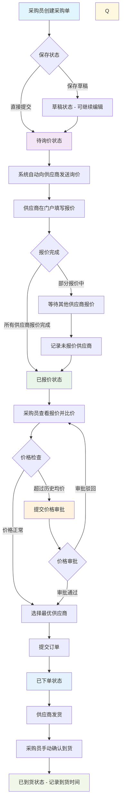
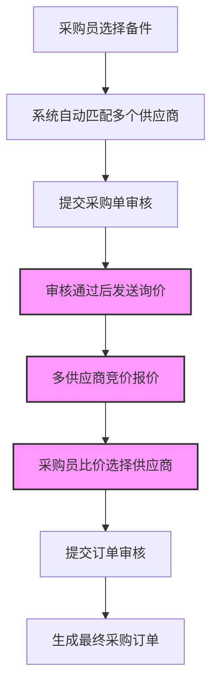

## **奥吉通集团配件集采系统 PRD**

**版本：** 1.0 **日期：** 2024-09-20 **文档状态：** 草案 **撰写人：** 马煜珲

---

### 1. 项目概述

#### 1.1 项目背景

本集团目前车辆配件采购流程分散在各门店，通过 Excel、邮件或电话等方式进行，存在以下问题：

- **效率低下：** 采购申请、审批、询价、下单环节割裂，沟通成本高。
- **不透明：** 采购状态、价格对比、供应商表现难以实时追踪和评估。
- **成本控制弱：** 缺乏统一的比价和议价机制，无法发挥集团采购的量价优势。
- **数据孤岛：** 采购数据分散，难以进行汇总分析，为决策提供支持。

#### 1.2 项目目标

构建一个统一的线上配件集采平台，旨在：

- **标准化流程：** 将采购流程线上化、标准化，减少人为错误和延迟。
- **提升效率：** 通过系统自动化流转（如审批、通知），缩短整体采购周期。
- **降低成本：** 通过集中询价、比价，筛选优质供应商，降低采购成本。
- **数据驱动决策：** 积累采购数据，为成本分析、供应商管理和库存优化提供数据支持。

#### 1.3 用户角色

| 角色 | 核心职责 | 系统权限 |
| :-- | :-- | :-- |
| **采购员**（各门店） | - 创建、编辑、提交采购单 `<br>`- 查看自己创建的采购单状态 `<br>`- 比价并生成订单 `<br>`- 确认到货并记录到货时间 `<br>`- 查询历史报价记录 | 核心用户，拥有采购单的创建、查看（本人）、到货确认权限 |
| **采购审核员**（集团/区域） | - 审批超价报价 `<br>`- 驳回价格异常的报价<br />- 商品信息、配件、供应商信息的配置<br />- 查看报价记录和分析<br />- 处理特殊采购需求 | 价格审批权限、系统配置权限，可查看所有采购单及历史单据 |
| **供应商**（分类管理） | - 接收询价单 `<br>`- 在规定时间内进行报价 `<br>`- 查看已接订单状态 `<br>`- 【回采供应商】历史合作良好，优先推荐 `<br>`- 【非回采供应商】新合作或候选 | 外部门户用户，仅有与自身相关的询价、报价、订单查看权限 |
| **系统管理员** | - 用户及角色管理 `<br>`- 基础数据维护（门店、配件目录、供应商信息、品牌管理）`<br>`- 供应商标签管理 `<br>`- 系统配置与监控 | 最高权限，负责系统后台管理 |

---

### 2. 功能需求

#### 2.1 采购单管理模块

##### 2.1.1 采购列表与筛选

- **功能描述：** 为用户提供一个总览视图，展示所有有权限查看的采购单。
- **需求详情：**
  1. **列表显示：** 列表需显示关键字段：采购单号、创建日期、采购门店、采购人、总金额、当前状态（如：草稿/待审核/待报价/已报价/已下单/已完成）。
  2. **筛选功能：** 列表上方提供筛选条件，至少包括：
     - 采购单号（精确/模糊搜索）
     - 采购日期范围（开始日期-结束日期）
     - 采购门店（下拉选择，多选）
     - 采购人（下拉选择）
     - 采购单状态（下拉选择，多选）
  3. **操作入口：** 列表右上方有醒目的 **【新建采购单】** 按钮。
  4. **查看详情：** 点击列表中的任一 **“采购单号”**，应跳转至该采购单的详情页面。

##### 2.1.2 采购单详情页

- **功能描述：** 展示采购单的所有信息及其完整流转记录。
- **需求详情：**
  1. **基本信息区：** 显示采购单号、创建人、创建门店、创建时间、期望到货日期、备注等。
  2. **配件清单区：** 以表格形式清晰列出所采购的配件详情，包括：配件编码、配件名称、规格型号、采购数量、单位、**历史采购均价**（参考用）。
  3. **状态流水区：** 以时间线形式展示采购单的完整生命周期，如：创建 → 提交 → 审核通过 → 已发送询价 → 供应商 A 报价 → 生成订单等，并记录每个环节的操作人和时间。
  4. **报价信息区（审核通过后可见）：** 展示各供应商的报价详情，用于比价。

#### 2.2 采购单创建与审核流程

##### 2.2.1 新建采购单

- **功能描述：** 采购员根据需求创建新的采购申请。
- **需求详情：**
  1. **表单填写：**
     - 系统自动生成唯一采购单号。
     - 自动填充当前用户及其所属门店。
     - 填写期望到货日期（必填）。
     - 可选择从模板创建或手动添加配件。
  2. **配件添加：**
     - 通过配件编码或名称搜索集团统一的配件库进行添加。
     - 对于备件，需先选择品牌（奥迪、红旗、林肯等），再选择具体配件。
     - 填写所需数量。
     - 可批量导入配件清单（支持 Excel 模板）。
     - 系统显示商品的历史均价供参考。
  3. **状态管理：**
     - 保存为 **【草稿】**：可随时修改，不会进入询价流程。
     - 点击 **【提交】**：采购单状态直接变为 **【待询价】**，系统自动根据配件类别和品牌，向符合条件的供应商池（优先推荐回采供应商）发送询价通知。

##### 2.2.2 订单生成（已取消订单审核）

- **功能描述：** 采购员完成供应商选择后，直接生成正式采购订单。
- **需求详情：**
  1. **订单生成：** 点击 **【提交订单】** 后，系统直接生成正式采购订单，状态变为 **【已下单】**。
  2. **自动通知：** 系统自动通知选中的供应商准备发货。
  3. **订单确认：** 订单一旦提交，不可撤销，如需修改需联系审核员。

#### 2.3 询价与报价模块

- **功能描述：** 系统自动化处理审核通过后的询价和报价环节。
- **需求详情：**
  1. **自动询价：** 采购单审核通过后，系统根据预设规则（如配件分类对应首选供应商）自动生成询价单，并通过短信/邮件/供应商门户站内信通知相关供应商。
  2. **报价周期：** 为每个询价单设置报价截止时间。
  3. **供应商报价：** 供应商登录其外部门户，查看询价单详情，并在线填写报价（含单价、总价、预计交货期等）。
  4. **报价展示：** 所有报价在截止时间后，统一在采购单详情页的“报价信息区”对采购员可见，以便公平比价。

#### 2.4 比价与订单生成（新增核心环节）

- **功能描述：** 采购员基于报价结果，选择最优供应商并生成正式采购订单。
- **需求详情：**
  1. **比价界面：** 系统以清晰的方式（如表格）并列展示不同供应商的报价，并自动计算总价差异。
  2. **供应商选择：** 采购员综合考虑价格、交货期、供应商历史评级等因素，选择一家或多家供应商（可分拆订单）。
  3. **未报价记录：** 系统自动记录未在规定时间内报价的供应商，生成未报价记录便于后续追踪和考核。
  4. **价格审批机制：** 若选中的报价超过商品历史均价或系统设定的价格阈值，需提交价格审批流程，审批通过后方可提交订单。
  5. **提交订单：** 点击 **【提交订单】**，系统将选中的报价信息转化为正式采购订单，状态直接变为 **【已下单】**，无需再次审核。
  6. **订单通知：** 系统自动将订单发送给对应供应商，通知准备发货。
  7. **报价记录归档：** 每次报价选择的完整记录（包括所有供应商报价、选择理由、决策人等）自动归档，支持后续查询和审计。

#### 2.5 报价记录查询模块

- **功能描述：** 提供完整的报价历史记录查询功能，支持数据分析和审计追溯。
- **需求详情：**
  1. **报价记录查询页面：**
     - 可按采购单号、配件名称、供应商、时间范围等条件筛选
     - 展示每次询价的完整记录：发送时间、截止时间、报价供应商数、未报价供应商数
     - 显示最终选择的供应商及选择理由
  2. **未报价记录专项：**
     - 统计和展示每个供应商的未报价次数
     - 支持按时间段、配件类别分析未报价情况
     - 为供应商考核提供数据支持
  3. **价格对比分析：**
     - 展示历史报价趋势
     - 同类商品不同供应商价格对比
     - 价格异常预警（超过均价一定比例）
  4. **数据导出：** 支持将报价记录导出为 Excel，便于深度分析和存档。

#### 2.6 到货管理模块

- **功能描述：** 记录采购订单的到货情况，完善采购全流程闭环。
- **需求详情：**
  1. **到货确认：**
     - 订单状态为"已下单"时，采购员可手动标记"已到货"
     - 填写实际到货日期和到货数量
     - 可上传到货凭证（如签收单照片）
  2. **到货时间记录：**
     - 系统自动记录到货确认时间
     - 计算实际交货周期（下单日期 → 到货日期）
     - 与预计交货期对比，生成供应商履约率数据
  3. **到货异常处理：**
     - 支持部分到货、延迟到货、质量问题等异常情况登记
     - 异常情况需填写说明并通知相关人员
  4. **数据统计：**
     - 供应商平均交货周期统计
     - 准时交货率分析
     - 为供应商评级提供数据支持

---

### 3. 非功能需求

- **性能：** 页面加载时间应小于 3 秒，关键操作（如查询、提交）响应时间小于 2 秒。
- **安全性：**
  - 基于角色的权限访问控制（RBAC），数据隔离（如 A 门店采购员不能查看 B 门店数据）。
  - 敏感操作（如审核、下单）需有日志记录。
  - 供应商外部门户与内部系统严格隔离。
- **可用性：** 界面简洁直观，符合业务操作习惯。提供明确的操作指引和状态提示。
- **可靠性：** 系统月度可用性不低于 99.9%，核心业务流程 7x24 小时可用。

---

### 4. 采购流程图

#### 4.1 完整业务流程



#### 4.2 状态说明

| 状态码 | 状态名称 | 状态描述 | 可执行操作 | 操作角色 |
| --- | --- | --- | --- | --- |
| 1 | 草稿 | 采购单已创建但未提交 | 编辑、提交 | 采购员 |
| 2 | 待询价 | 采购单已提交，系统发送询价等待供应商报价 | 等待、催促、查看报价进度 | 采购员/供应商 |
| 3 | 已报价 | 供应商已完成报价，可进行比价选择 | 查看报价、选择供应商、提交订单 | 采购员 |
| 4 | 价格待审批 | 选中报价超过历史均价，需审批 | 价格审批 | 审核员 |
| 5 | 已下单 | 已提交订单，正式下单 | 跟踪发货、确认到货 | 采购员/供应商 |
| 6 | 已到货 | 采购员确认到货，记录到货时间 | 查看到货详情、评价供应商、归档 | 采购员 |

#### 4.3 关键业务规则

1. **简化流程机制**

   - 取消采购单审核，采购员提交后直接进入询价流程
   - 取消订单审核，采购员提交订单后直接变为已下单状态
   - 价格审批：超过历史均价的报价需单独审批

2. **供应商报价规则**

   - 每个询价单设置报价截止时间
   - 供应商只能看到自己的报价，无法看到其他供应商报价
   - 采购员只有在报价完成后才能看到所有报价
   - **未报价记录**：系统自动记录未在截止时间内报价的供应商，计入供应商考核

3. **价格管控规则**

   - 系统维护每个商品的历史均价
   - 选择的报价若超过历史均价设定比例（如 15%），触发价格审批流程
   - 价格审批需填写超价原因和说明
   - 审批通过后方可继续提交订单

4. **报价记录归档**

   - 每次询价的完整记录自动归档（包括所有报价、未报价供应商、最终选择）
   - 支持按多维度查询历史报价记录
   - 为供应商考核和价格分析提供数据基础

5. **到货确认规则**

   - 已下单状态的订单，由采购员手动确认到货
   - 确认到货时必须填写实际到货日期
   - 系统自动计算交货周期并记录供应商履约情况
   - 到货时间用于后续供应商评级和周期分析

6. **状态流转规则**

   - 价格审批驳回后回到已报价状态，可重新选择供应商
   - 提交订单后直接变为已下单状态，无需审核
   - 每个状态变更都有完整的操作日志

7. **权限控制**

   - 采购员：只能查看自己创建的采购单
   - 审核员：可以查看所有需要审核的采购单和价格审批
   - 供应商：只能查看与自己相关的询价和订单

8. **供应商分类管理**

   - **回采供应商**：历史有过成功合作记录的供应商，优先推荐
   - **非回采供应商**：新合作或候选供应商，需更严格的审核
   - 系统根据供应商标签自动调整询价策略和评分权重

---

### 5. 商品系统模块

#### 5.1 商品分类体系

系统支持两大类商品，采用不同的采购和报价模式：

##### 5.1.1 备件（标准配件）

- **定义：** 车辆维修保养所需的标准化配件，如机油滤清器、刹车片、火花塞等。备件商品详情由平台直接维护。
- **特点：**
  - 商品类型相对固定，规格标准化
  - 不同供应商可提供相同规格的备件
  - 价格波动相对较大，需要定期询价
- **品牌分类：** 备件按汽车品牌方进行分类管理，主要包括：
  - **豪华品牌**：奥迪（Audi）、宝马（BMW）、奔驰（Mercedes-Benz）、林肯（Lincoln）等
  - **合资品牌**：大众（Volkswagen）、丰田（Toyota）、本田（Honda）、福特（Ford）等
  - **自主品牌**：红旗（Hongqi）、吉利（Geely）、比亚迪（BYD）、长城（Great Wall）等
  - 不同品牌的备件规格、认证要求不同，需单独维护和管理

##### 5.1.2 精品（增值商品）

- **定义：** 车辆美化、改装、个性化所需的非标准化商品，如车膜、脚垫、香水等。精品商品详情需要供应商及时维护。
- **特点：**
  - 商品类型多样化且不固定，经常有新品
  - 不同供应商提供的精品通常是不同的（品牌、款式、规格）
  - 价格相对稳定，按供应商目录价格采购

#### 5.2 商品系统层级设计

商品系统分为三个层级：

**第一层级：品类树**

示例如下：

品类树主要用于对商品进行分类，便于使用时查找和后续的大类统计分析。（品类树层级建议在 2-3 层，不宜过深。）

```
配件目录
├── 备件 (Parts) - 按品牌分类
│   ├── 奥迪 (Audi)
│   │   ├── 发动机系统
│   │   │   ├── 机油滤清器
│   │   │   ├── 空气滤清器
│   │   │   └── 火花塞
│   │   ├── 制动系统
│   │   │   ├── 刹车片
│   │   │   └── 刹车盘
│   │   └── 传动系统
│   ├── 红旗 (Hongqi)
│   │   ├── 发动机系统
│   │   ├── 制动系统
│   │   └── 底盘系统
│   ├── 林肯 (Lincoln)
│   │   ├── 发动机系统
│   │   ├── 制动系统
│   │   └── 电气系统
│   └── 其他品牌...
└── 精品 (Accessories)
    ├── 车内饰品
    │   ├── 脚垫系列
    │   ├── 座套系列
    │   └── 香水系列
    ├── 车外装饰
    │   ├── 车膜系列
    │   ├── 轮毂系列
    │   └── 尾翼系列
    └── 电子设备
        ├── 行车记录仪
        ├── 导航设备
        └── 音响系统
```

**第二层级：产品**

产品是同一类资源的聚合，在品类树子节点可以挂接多个产品，产品层描述该商品的基本属性。

产品下供应商可自定义销售属性（如颜色、品牌、材质、图案等），每一个销售属性仅可单选，选定了所有销售属性即可对应到唯一资源。

产品信息：

1. 产品名称
2. 设定各类销售属性
3. 产品编码（默认规则生成）
4. 产品备注
5. 描述属性（如单位等）

**特殊销售属性：适用车型。可以多选，由平台维护制定范围，再由供应商进行勾选。**

**第三层级：资源**

资源，又称 sku，是商品的最小层级单位，对应到一个商品实物。挂载到产品之下，产品:资源 为 1:N。

举例：iPhone8（对应产品），选择颜色银色（销售属性 1），规格选择 1TB（销售属性 2），才能以该实物（对应资源）下单。

资源基本信息：

1. 标题（尽量透出更多信息，供搜索使用）
2. 资源规格
3. 所属的销售属性
4. 资源编码（默认规则生成）
5. 资源展示信息
6. 资源备注
7. 资源展示图片

#### 5.3 数据字段定义

#### 5.4 采购流程



##### 5.5.1 配件目录管理后台

**基础功能：**

1. **分类管理**

   - 支持多级分类创建和编辑
   - 分类与商品类型（备件/精品）绑定
   - 分类排序和状态管理

2. **备件管理**

   - 备件基础信息维护
   - 适用车型关联管理
   - 历史价格记录和分析
   - 供应商资质匹配规则设置

3. **精品管理**

   - 精品信息维护（包含供应商绑定）
   - 固定价格管理和更新
   - 库存状态同步
   - 新品上架审核流程

##### 5.5.2 采购端差异化体验

**备件采购：**

- 按车型筛选适用备件
- 显示历史采购均价作为参考
- 进入标准询价比价流程
- 支持技术规格对比

**精品采购：**

- 按供应商浏览商品目录
- 直接显示固定价格和库存状态
- 支持图片展示和详细描述
- 一键添加到购物车式采购

##### 5.5.3 供应商端差异化功能

**备件供应商：**

- 接收询价单并在线报价
- 查看竞争对手报价结果（脱敏）
- 历史中标率和价格走势分析

**精品供应商：**

- 管理自己的商品目录和价格
- 接收直接采购订单
- 库存状态实时更新
- 新品申请上架流程

#### 5.6 系统集成要求

1. **与现有系统对接**

   - 车型库数据同步
   - 供应商主数据管理
   - 库存管理系统集成

2. **数据同步机制**

   - 精品价格定期同步更新
   - 库存状态实时同步
   - 新品信息自动推送

3. **权限控制**

   - 不同角色看到不同商品目录
   - 备件和精品采购权限分离
   - 价格敏感信息访问控制

#### 5.7 供应商分类与标签管理

##### 5.7.1 供应商标签体系

- **回采供应商**

  - 定义：与集团有历史合作记录，表现良好的供应商
  - 优势：优先推荐、简化审核流程、更高信任度
  - 标准：成功履约订单数 ≥ 3 单，准时交货率 ≥ 90%，无重大质量问题

- **非回采供应商**

  - 定义：新合作供应商或候选供应商
  - 管理：需要更严格的资质审核和订单审批
  - 转化：满足回采标准后可申请转为回采供应商

##### 5.7.2 供应商评级规则

基于以下维度对供应商进行综合评级：

1. **报价响应率**：报价及时性和参与度
2. **价格竞争力**：报价相对市场价格的优势
3. **交货准时率**：实际交货时间与承诺时间对比
4. **产品质量**：到货质量、退换货率
5. **合作历史**：累计订单数、合作年限

##### 5.7.3 未报价记录与考核

- **记录规则**

  - 系统自动记录每次询价未响应的供应商
  - 统计未报价次数和未报价率
  - 生成供应商报价响应分析报告

- **考核影响**

  - 未报价率高于 30%的供应商将被标记预警
  - 连续 3 次未报价的供应商将被暂停推荐
  - 未报价记录影响供应商综合评级

- **改善机制**

  - 供应商可查看自己的未报价记录
  - 可提交未报价原因说明
  - 改善后可申请重新评估

### 6. 未来迭代考虑

- **供应商管理模块：** 建立供应商准入、考核和分级体系。
- **数据分析报表：** 提供采购成本分析、供应商绩效、采购周期等报表。
- **库存联动接口：** 与集团现有库存管理系统集成，实现低库存自动生成采购建议。
- **移动端支持：** 开发 App 或 H5 页面，支持审批、关键状态查询等移动办公场景。
- **智能推荐：** 基于历史采购数据，为门店推荐常用备件和热销精品。

---
