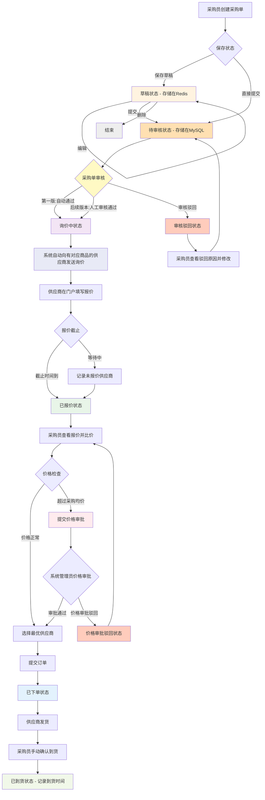

## **奥吉通集团配件集采系统 PRD**

**版本：** 2.0 **日期：** 2024-11-20 **文档状态：** 正式版 **撰写人：** 系统架构团队

---

### 1. 项目概述

#### 1.1 项目背景

本集团目前车辆配件采购流程分散在各门店，通过 Excel、邮件或电话等方式进行，存在以下问题：

- **效率低下：** 采购申请、审批、询价、下单环节割裂，沟通成本高。
- **不透明：** 采购状态、价格对比、供应商表现难以实时追踪和评估。
- **成本控制弱：** 缺乏统一的比价和议价机制，无法发挥集团采购的量价优势。
- **数据孤岛：** 采购数据分散，难以进行汇总分析，为决策提供支持。

#### 1.2 项目目标

构建一个统一的线上配件集采平台，旨在：

- **标准化流程：** 将采购流程线上化、标准化，减少人为错误和延迟。
- **提升效率：** 通过系统自动化流转（如自动询价、通知），缩短整体采购周期。
- **降低成本：** 通过集中询价、比价，筛选优质供应商，降低采购成本。
- **数据驱动决策：** 积累采购数据，为成本分析、供应商管理和库存优化提供数据支持。

#### 1.3 用户角色

| 角色 | 核心职责 | 系统权限 |
| :-- | :-- | :-- |
| **采购员**（各门店） | - 创建、编辑、提交采购单 `<br>`- 查看自己创建的采购单状态 `<br>`- 比价并生成订单 `<br>`- 确认到货并记录到货时间 `<br>`- 查询历史报价记录 | 核心用户，拥有采购单的创建、查看（本人）、到货确认权限 |
| **供应商** | - 接收询价单 `<br>`- 在规定时间内进行报价 `<br>`- 查看已接订单状态 | 外部门户用户，仅有与自身相关的询价、报价、订单查看权限 |
| **系统管理员** | - 用户及角色管理 `<br>`- 基础数据维护（门店、配件目录、供应商信息、品牌管理）`<br>`- **价格审批**（超价报价审批/驳回）`<br>`- 商品信息、配件、供应商信息的配置 `<br>`- 查看报价记录和分析 `<br>`- 系统配置与监控 | 最高权限，负责系统后台管理和价格审批 |

**角色说明：**

- 取消了独立的"采购审核员"角色
- 原采购审核员的价格审批、系统配置等职责由系统管理员承担
- 供应商通过绑定系统分配外部门户访问权限
- 所有供应商性质相同，无需分类标记

---

### 2. 功能需求

#### 2.1 采购单管理模块

##### 2.1.1 采购列表与筛选

- **功能描述：** 为采购员提供采购单总览视图，支持草稿和正式采购单的分类管理。
- **需求详情：**

  **1. Tab 页切换**

  采购单列表页面包含两个 Tab：

  - **草稿列表 Tab**

    - 展示保存为草稿状态的采购单
    - 数据存储在 Redis 中，保存期限 3 天
    - 草稿采购单可随时编辑、删除或提交
    - 不显示在正式采购单列表中

  - **采购单列表 Tab**

    - 展示已提交的正式采购单
    - 数据存储在 MySQL 数据库中
    - 采购单一旦提交不可删除，只能查看和后续操作

  **2. 草稿列表显示字段**

  - 采购单号（临时编号）
  - 创建日期
  - 采购门店
  - 期望到货时间
  - 询价截止时间
  - 配件数量
  - 操作按钮：编辑、删除、提交

  **3. 采购单列表显示字段**

  - 采购单号（正式编号）
  - 创建日期
  - 采购门店
  - 采购人
  - 当前状态（待审核/审核驳回/询价中/已报价/价格待审批/价格审批驳回/已下单/已到货）
  - 操作按钮：查看详情

  **4. 筛选功能**

  采购单列表 Tab 提供以下筛选条件：

  - 采购单号（精确/模糊搜索）
  - 采购日期范围（开始日期-结束日期）
  - 采购门店（下拉选择，多选）
  - 采购人（下拉选择）
  - 采购单状态（下拉选择，多选）

  **5. 操作入口**

  - 列表右上方有醒目的 **【新建采购单】** 按钮
  - 点击后进入采购单创建表单页面

  **6. 查看详情**

  - 草稿列表：点击"编辑"按钮进入编辑页面
  - 采购单列表：点击"采购单号"或"查看详情"跳转至详情页面

##### 2.1.2 采购单详情页

- **功能描述：** 展示采购单的所有信息及其完整流转记录。
- **需求详情：**

  **1. 基本信息区**

  显示以下信息：

  - 采购单号
  - 创建人
  - 创建门店（自动填充）
  - 创建时间
  - 期望到货日期
  - 询价截止时间
  - 备注

  **2. 配件清单区**

  以表格形式列出采购的配件详情：

  - 品牌（如：奥迪、宝马、大众等）
  - SKU ID（商品表中的唯一标识）
  - 采购数量
  - 采购均价（从商品表自动获取）

  **3. 状态流水区**

  以时间线形式展示采购单的完整生命周期：

  - 草稿创建
  - 提交审核
  - 审核通过（第一版自动通过）
  - 系统自动发起询价
  - 供应商报价进度
  - 价格审批（如有）
  - 订单生成
  - 到货确认

  每个环节记录操作人和时间。

  **4. 报价信息区（已报价状态可见）**

  展示各供应商的报价详情，用于比价选择。

#### 2.2 采购单创建与提交流程

##### 2.2.1 新建采购单

- **功能描述：** 采购员根据需求创建新的采购申请。
- **需求详情：**

  **1. 表单填写**

  采购单创建表单包含以下字段：

  - **采购单号**

    - 草稿状态：系统生成临时单号
    - 提交后：使用系统统一的 ID 生成算法生成正式采购单号

  - **采购门店**（必填）

    - 自动填充当前用户所属门店
    - 不可修改（确保权限正确）

  - **期望到货日期**（必填）

    - 日期选择器
    - 必须大于当前日期
    - 用于供应商交期参考

  - **询价截止时间**（可选）

    - 日期时间选择器
    - 如不填写，系统默认为提交后 7 天
    - 必须大于当前时间且小于期望到货日期
    - 供应商必须在此时间前完成报价

  - **备注**（可选）

    - 多行文本输入框
    - 最多 500 字
    - 可填写特殊要求或说明

  **2. 配件添加**

  - **从商品表选择**

    - 通过品牌、SKU ID 或商品名称搜索商品表
    - 需先选择品牌（奥迪、宝马、大众等）
    - 选择具体商品后，系统自动填充：
      - SKU ID（商品唯一标识）
      - 采购均价（来自商品表，用于后续价格审批对比）
    - 采购员仅需填写所需数量

  - **均价显示**

    - 选中商品后，系统自动显示该商品的采购均价
    - 采购均价存储在商品表中，供后续报价审批使用
    - 显示最近一次采购时间作为参考

  **3. 状态管理**

  - **保存为草稿**

    - 点击 **【保存草稿】** 按钮
    - 数据保存在 Redis 中，有效期 3 天
    - 可随时返回继续编辑
    - 可删除草稿
    - 不会进入询价流程
    - **提交采购单**

      - 点击 **【提交】** 按钮
      - 系统验证必填字段
      - 验证通过后：
        - 使用系统统一的 ID 生成算法生成正式采购单号
        - 将数据从 Redis 迁移到 MySQL
        - 采购单状态变为 **【待审核】**
        - 进入采购单审核流程
        - 删除对应的草稿数据

      **注意：** 第一版实现中，审核流程暂不启用，采购单提交后自动审核通过，直接进入询价流程。

##### 2.2.2 采购单审核（预留功能）

- **功能描述：** 采购单提交后进入审核流程，审核通过后才能发起询价。
- **需求详情：**

  **1. 审核流程**

  - 采购单提交后，状态变为 **【待审核】**
  - 系统管理员可以查看待审核的采购单
  - 审核内容包括：
    - 配件信息是否完整准确
    - 数量是否合理
    - 期望到货时间是否合理
    - 备注说明是否清晰

  **2. 审核操作**

  - **审核通过**：

    - 点击 **【审核通过】** 按钮
    - 采购单状态变为 **【询价中】**
    - 系统自动触发询价流程

  - **审核驳回**：

    - 点击 **【驳回】** 按钮
    - 必须填写驳回原因
    - 采购单状态变为 **【审核驳回】**
    - 通知采购员修改后重新提交

  **3. 第一版实现说明**

  - **自动审核通过**：第一版中，采购单提交后自动审核通过
  - 系统记录"系统自动审核"的日志
  - 直接进入询价流程，无需人工干预
  - 为后续启用人工审核预留了流程和状态

  **4. 权限说明**

  - 系统管理员拥有审核权限
  - 采购员可以查看自己采购单的审核状态
  - 驳回后采购员可以修改并重新提交

##### 2.2.3 自动询价机制

- **功能描述：** 采购单审核通过后，系统自动化处理询价流程。
- **需求详情：**

  **1. 自动发起询价**

  - 采购单审核通过后，系统立即触发自动询价流程
  - 第一版中，提交后自动审核通过，立即进入询价
  - 无需人工干预，无需采购方手动选择供应商
  - 确保询价过程的公平性和透明度

  **2. 供应商选择规则**

  - 系统根据采购单中的商品，自动获取有这些商品的供应商
  - 供应商与商品的关联关系维护在系统中（商品-供应商绑定表）
  - 仅向有对应商品的激活状态供应商发送询价单
  - 若某商品没有关联供应商，记录日志并通知采购员

  **3. 询价单生成**

  为每个有对应商品的供应商生成独立的询价单：

  - 询价单号：使用系统统一的 ID 生成算法（基于业务前缀+时间+序列号）
  - 关联采购单号
  - 供应商信息
  - 该供应商可供应的商品清单（仅包含供应商有的商品）
  - 询价截止时间（继承采购单设置）
  - 询价状态：待报价

  **4. 通知发送**

  系统通过以下方式通知供应商：

  - 供应商门户站内信
  - 邮件通知（如配置）
  - 短信通知（如配置）

##### 2.2.4 订单生成

- **功能描述：** 采购员完成供应商选择后，直接生成正式采购订单。
- **需求详情：**

  **1. 订单生成**

  - 点击 **【提交订单】** 后，系统直接生成正式采购订单
  - 状态变为 **【已下单】**
  - 无需额外审核流程（简化流程）

  **2. 自动通知**

  - 系统自动通知选中的供应商准备发货
  - 发送订单详情和配件清单

  **3. 订单确认**

  - 订单一旦提交，不可撤销
  - 如需修改需联系系统管理员

#### 2.3 询价与报价模块

- **功能描述：** 系统自动化处理询价和报价环节。
- **需求详情：**

  **1. 自动询价流程**

  - 采购单提交后系统自动发起，无需人工操作
  - 根据询价截止时间倒计时
  - 供应商可在门户中查看询价单详情

  **2. 报价周期**

  - 每个询价单有明确的报价截止时间
  - 截止时间前供应商可修改报价
  - 截止时间后不可再报价或修改

  **3. 供应商报价**

  供应商登录外部门户：

  - 查看询价单详情和配件清单（仅显示该供应商可供应的商品）
  - 在线填写报价信息（按配件逐项报价）：
    - **配件单价**（必填）
    - **预计交货期**（必填）
    - **备注说明**（可选）
  - 提交报价

  **字段说明：**

  - 配件单价：供应商对该配件的报价单价
  - 预计交货期：从下单到交货的预计天数或具体日期
  - 备注说明：供应商的补充说明（如品牌、产地、规格等）

  **说明：**

  - 不同供应商看到的商品清单可能不同
  - 仅显示该供应商在系统中关联的可供应商品

  **4. 报价展示**

  - 供应商只能看到自己的报价
  - 采购员在报价完成后可看到所有报价
  - 系统自动标识最低价供应商
  - 支持报价对比和分析

  **5. 未报价记录**

  - 系统自动记录未在截止时间内报价的供应商
  - 计入供应商考核指标
  - 影响供应商评级

#### 2.4 比价与订单生成

- **功能描述：** 采购员基于报价结果，选择最优供应商并生成正式采购订单。
- **需求详情：**

  **1. 比价界面**

  系统提供清晰的比价视图：

  - 按配件维度展示不同供应商的报价对比
  - 每个配件显示：
    - 品牌、SKU ID
    - **采购均价**（来自商品表，作为基准价）
    - 各供应商报价
    - 与采购均价的差异百分比
    - 超过价格阈值的标记（红色警示）
  - 自动计算每个供应商的订单总价
  - 突出显示最低价供应商
  - 显示供应商历史评级
  - 显示预计交货期对比

  **2. 供应商选择**

  采购员综合考虑以下因素：

  - 价格竞争力
  - 交货期
  - 供应商历史评级
  - 产品品牌和质量

  选择一家或多家供应商（可分拆订单）

  **3. 价格审批机制**

  **触发条件：**

  - 选中的供应商报价超过商品的采购均价（来自商品表）
  - 超过幅度 ≥ 系统设定的价格阈值（如 15%）
  - 计算公式：`(报价 - 采购均价) / 采购均价 × 100%`

  **审批流程：**

  - 系统自动对比每个配件的报价与采购均价
  - 若有超价配件，自动提交价格审批流程
  - 采购员必须填写超价原因和说明
  - 系统管理员查看报价、采购均价和超价幅度
  - **审批通过**：
    - 采购单继续流转，可提交订单
  - **价格审批驳回**：
    - 采购单状态变为 **【价格审批驳回】**
    - 采购员查看驳回原因
    - 返回比价界面重新选择供应商
    - 重新选择后再次提交，若仍超价则需再次审批

  **4. 提交订单**

  - 点击 **【提交订单】** 按钮
  - 系统将选中的报价信息转化为正式采购订单
  - 状态直接变为 **【已下单】**
  - 无需再次审核

  **5. 订单通知**

  - 系统自动将订单发送给对应供应商
  - 通知供应商准备发货
  - 发送订单详情和交货要求

  **6. 报价记录归档**

  每次报价选择的完整记录自动归档：

  - 所有供应商报价
  - 未报价供应商记录
  - 最终选择的供应商
  - 选择理由
  - 决策人

  支持后续查询和审计。

#### 2.5 报价记录查询模块

- **功能描述：** 提供完整的报价历史记录查询功能，支持数据分析和审计追溯。
- **需求详情：**

  **1. 报价记录查询页面**

  查询条件：

  - 采购单号
  - 配件名称
  - 供应商
  - 时间范围
  - 报价状态

  展示内容：

  - 每次询价的完整记录
  - 发送时间和截止时间
  - 报价供应商数和未报价供应商数
  - 最终选择的供应商及选择理由

  **2. 未报价记录专项**

  - 统计每个供应商的未报价次数
  - 计算未报价率
  - 按时间段、配件类别分析
  - 为供应商考核提供数据支持
  - 预警功能：未报价率超过 30% 标记预警

  **3. 价格对比分析**

  - 展示历史报价趋势图
  - 同类商品不同供应商价格对比
  - 价格异常预警（超过均价一定比例）
  - 价格走势分析

  **4. 数据导出**

  - 支持将报价记录导出为 Excel
  - 便于深度分析和存档
  - 支持自定义导出字段

#### 2.6 到货管理模块

- **功能描述：** 记录采购订单的到货情况，完善采购全流程闭环。
- **需求详情：**

  **1. 到货确认**

  订单状态为"已下单"时：

  - 采购员手动标记"已到货"
  - 填写实际到货日期（必填）
  - 填写实际到货数量（必填）
  - 可上传到货凭证（如签收单照片）
  - 填写到货备注

  **2. 到货时间记录**

  - 系统自动记录到货确认时间
  - 计算实际交货周期（下单日期 → 到货日期）
  - 与预计交货期对比
  - 生成供应商履约率数据

  **3. 到货异常处理**

  支持以下异常情况登记：

  - 部分到货（数量不足）
  - 延迟到货（超过预计交货期）
  - 质量问题
  - 其他异常

  异常处理：

  - 必须填写异常说明
  - 系统自动通知相关人员
  - 记入供应商考核

  **4. 数据统计**

  - 供应商平均交货周期统计
  - 准时交货率分析
  - 异常订单统计
  - 为供应商评级提供数据支持

---

### 3. 非功能需求

#### 3.1 性能要求

- **响应时间**

  - 页面加载时间 < 3 秒
  - 关键操作（查询、提交）响应时间 < 2 秒
  - 报价比价计算 < 1 秒

- **并发支持**

  - 支持 100+ 采购员同时在线
  - 支持 500+ 供应商同时报价
  - 数据库连接池合理配置

#### 3.2 数据存储

- **Redis 存储**

  - 草稿采购单数据
  - 有效期：3 天
  - 定时清理过期数据
  - 支持数据持久化备份

- **MySQL 存储**

  - 正式采购单数据
  - 询价单和报价数据
  - 订单和到货数据
  - 历史记录永久保存

#### 3.3 安全性

- **权限控制**

  - 基于角色的权限访问控制（RBAC）
  - 数据隔离（A 门店采购员不能查看 B 门店数据）
  - 供应商只能查看与自己相关的数据

- **操作审计**

  - 敏感操作（审核、下单）需有日志记录
  - 记录操作人、操作时间、操作内容
  - 支持日志查询和导出

- **系统隔离**

  - 供应商外部门户与内部系统严格隔离
  - API 接口鉴权
  - 数据传输加密

#### 3.4 可用性

- **界面设计**

  - 界面简洁直观
  - 符合业务操作习惯
  - 提供明确的操作指引和状态提示

- **容错设计**

  - 表单填写自动保存
  - 操作失败友好提示
  - 支持操作撤销（在允许的范围内）

#### 3.5 可靠性

- **系统可用性**

  - 月度可用性 ≥ 99.9%
  - 核心业务流程 7x24 小时可用

- **数据可靠性**

  - 数据库主从备份
  - Redis 数据持久化
  - 定期数据备份

---

### 4. 采购流程图

#### 4.1 完整业务流程



#### 4.2 状态说明

| 状态码 | 状态名称 | 状态描述 | 数据存储 | 可执行操作 | 操作角色 |
| --- | --- | --- | --- | --- | --- |
| 0 | 草稿 | 采购单已创建但未提交 | Redis | 编辑、删除、提交 | 采购员 |
| 1 | 待审核 | 采购单已提交，等待审核（第一版自动通过） | MySQL | 审核（第一版自动） | 系统管理员 |
| 2 | 审核驳回 | 采购单审核未通过 | MySQL | 查看驳回原因、修改后重新提交 | 采购员 |
| 3 | 询价中 | 审核通过，系统已发送询价，等待供应商报价 | MySQL | 查看、等待报价、催促 | 采购员/供应商 |
| 4 | 已报价 | 供应商已完成报价，可进行比价 | MySQL | 查看报价、选择供应商、提交订单 | 采购员 |
| 5 | 价格待审批 | 选中报价超过采购均价，需审批 | MySQL | 价格审批（通过/驳回） | 系统管理员 |
| 6 | 价格审批驳回 | 价格审批未通过 | MySQL | 查看驳回原因、重新选择供应商 | 采购员 |
| 7 | 已下单 | 已提交订单，正式下单 | MySQL | 跟踪发货、确认到货 | 采购员/供应商 |
| 8 | 已到货 | 采购员确认到货，记录到货时间 | MySQL | 查看详情、评价供应商 | 采购员 |

#### 4.3 关键业务规则

**1. 草稿管理规则**

- 草稿数据存储在 Redis 中，有效期 3 天
- 超过 3 天的草稿自动清理
- 草稿可随时编辑、删除
- 提交后草稿数据迁移到 MySQL，Redis 中的草稿数据删除
- 每个采购员可以有多个草稿

**2. 采购单审核规则**

- 采购单提交后进入待审核状态
- 第一版实现：系统自动审核通过，记录"系统自动审核"日志
- 后续版本：支持系统管理员人工审核
- 审核通过后自动触发询价流程
- 驳回后采购员可以修改并重新提交
- 审核操作需要记录审核人、审核时间、审核意见

**3. 自动询价规则**

- 采购单审核通过后立即触发自动询价
- 第一版中，提交后自动审核通过，立即发起询价
- 系统根据采购单中的商品，自动获取有这些商品的供应商
- 供应商与商品的关联关系在系统中预先维护
- 仅向有对应商品的激活状态供应商发送询价单
- 一个供应商可能只收到部分商品的询价（该供应商能供应的商品）
- 无需人工选择供应商，确保公平性
- 询价单号使用系统统一的 ID 生成算法

**4. 供应商报价规则**

- 每个询价单有明确的报价截止时间
- 供应商只能看到自己的报价
- 采购员只有在报价完成后才能看到所有报价
- 未报价记录自动归档，计入供应商考核

**5. 价格管控规则**

- 每个商品在商品表中维护采购均价
- 采购员选择商品时，系统自动获取该商品的采购均价
- 比价时，系统自动对比供应商报价与商品的采购均价
- 若报价超过采购均价的设定比例（如 15%），触发价格审批
- 计算公式：`(报价 - 采购均价) / 采购均价 × 100%`
- 价格审批需填写超价原因和说明
- 由系统管理员审批，查看报价、采购均价、超价幅度
- **审批通过**：采购单继续流转，可提交订单
- **价格审批驳回**：
  - 采购单状态变为"价格审批驳回"
  - 采购员查看驳回原因后返回比价界面
  - 重新选择供应商，若仍超价则需再次审批

**6. 订单流转规则**

- 采购单提交后不可删除，只能查看
- 订单提交后不可撤销
- **审核驳回后**：采购员修改后可重新提交
- **价格审批驳回后**：采购员重新选择供应商，若仍超价需再次审批
- 每个状态变更都有完整的操作日志
- 驳回操作必须填写驳回原因

**7. 权限控制规则**

- 采购员：只能查看自己创建的采购单和草稿
- 系统管理员：可以查看所有采购单和草稿，可以进行价格审批
- 供应商：只能查看与自己相关的询价和订单

**8. 数据归档规则**

- 每次询价的完整记录自动归档
- 包括所有报价、未报价供应商、最终选择
- 支持按多维度查询历史记录
- 为供应商考核和价格分析提供数据基础

**9. 商品-供应商关联规则**

- 系统维护商品与供应商的多对多关联关系
- 一个商品可以由多个供应商供应
- 一个供应商可以供应多个商品
- 自动询价时，仅向有对应商品的供应商发送询价
- 若采购单中的某商品没有关联供应商，系统记录日志并通知采购员
- 所有供应商性质相同，无需分类标记

---

### 5. 商品系统模块

#### 5.1 商品分类体系

系统支持标准化的配件商品管理：

##### 5.1.1 配件商品

- **定义：** 车辆维修保养所需的标准化配件，如机油滤清器、刹车片、火花塞等。
- **特点：**

  - 商品类型相对固定，规格标准化
  - 不同供应商可提供相同规格的配件
  - 价格波动相对较大，需要定期询价
  - 适用自动询价和比价流程

- **品牌分类：**

  - **豪华品牌**：奥迪（Audi）、宝马（BMW）、奔驰（Mercedes-Benz）、林肯（Lincoln）
  - **合资品牌**：大众（Volkswagen）、丰田（Toyota）、本田（Honda）、福特（Ford）
  - **自主品牌**：红旗（Hongqi）、吉利（Geely）、比亚迪（BYD）、长城（Great Wall）

#### 5.2 配件目录管理

**基础功能：**

1. **分类管理**

   - 支持多级分类创建和编辑
   - 分类包含订单类型字段（`order_type`）用于区分不同订单类型
   - 分类排序和状态管理

2. **配件管理**

   - 配件基础信息维护（SKU ID、品牌、名称等）
   - 适用车型关联管理
   - 采购均价记录和维护
   - 供应商关联关系设置

#### 5.3 供应商评级

基于以下维度对供应商进行综合评级：

1. **报价响应率**：报价及时性和参与度
2. **价格竞争力**：报价相对市场价格的优势
3. **交货准时率**：实际交货时间与承诺时间对比
4. **产品质量**：到货质量、退换货率
5. **合作历史**：累计订单数、合作年限

- **记录规则**
- 系统自动记录每次询价未响应的供应商
- 统计未报价次数和未报价率
- 生成供应商报价响应分析报告

**考核影响：**

- 未报价率高于 30% 的供应商标记预警
- 连续 3 次未报价的供应商暂停推荐
- 未报价记录影响供应商综合评级

---

### 6. 系统管理模块

#### 6.1 用户管理

- 用户账号创建、编辑、停用
- 角色分配（采购员、系统管理员、供应商）
- 门店绑定
- 密码重置

#### 6.2 门店管理

- 门店信息维护
- 门店层级管理
- 门店状态管理

#### 6.3 供应商管理

- 供应商信息维护
- 供应商状态管理（激活/禁用/删除）
- 供应商评级管理
- **商品-供应商关联管理**
  - 维护供应商可供应的商品列表
  - 支持批量导入和编辑
  - 设置供应商对特定商品的优先级
  - 系统自动询价时根据此关联关系筛选供应商

#### 6.4 配件目录管理

- 配件分类管理
- 配件信息维护（SKU ID、品牌、名称等）
- 品牌管理
- 采购均价维护
- **商品可供应供应商查询**
  - 查看每个商品有哪些供应商可供应
  - 便于管理员了解商品的供应商覆盖情况

#### 6.5 系统配置

- 价格阈值配置
- 询价截止时间默认配置
- 通知方式配置
- 审核开关配置（第一版关闭自动审核，后续可开启人工审核）
- 系统参数配置

#### 6.6 采购单审核管理（预留功能）

- 待审核采购单列表
- 审核详情查看
- 审核通过操作
- 审核驳回操作（需填写驳回原因）
- 审核记录查询

---

### 7. 分阶段实现说明

#### 7.1 第一版实现（当前版本）

**核心功能：**

- ✅ 草稿管理（Redis）
- ✅ 采购单创建和提交
- ✅ **自动审核通过**（预留审核流程，默认通过）
- ✅ 自动发起询价
- ✅ 供应商报价
- ✅ 比价和供应商选择
- ✅ 价格审批
- ✅ 订单生成
- ✅ 到货确认

**简化处理：**

- 采购单提交后自动审核通过，无需人工干预
- 系统记录"系统自动审核"的操作日志
- 保留审核状态和数据表结构，为后续启用人工审核做准备

#### 7.2 第二版迭代计划

**增强功能：**

- 🔄 启用人工审核功能
- 🔄 审核工作台和待审核列表
- 🔄 审核驳回和修改流程
- 🔄 审核权限细化
- 🔄 数据分析报表
- 🔄 库存联动接口

#### 7.3 未来迭代考虑

- **移动端支持：** 开发 App 或 H5 页面，支持移动办公场景
- **智能推荐：** 基于历史采购数据，推荐常用配件和优质供应商
- **供应商门户增强：** 增加供应商自助管理功能
- **多级审批流程：** 支持复杂的多级审批配置

---

### 8. 附录

#### 8.1 术语表

| 术语         | 说明                                                       |
| ------------ | ---------------------------------------------------------- |
| 草稿         | 保存但未提交的采购单，存储在 Redis 中                      |
| 采购单       | 已提交的正式采购单，存储在 MySQL 中                        |
| 待审核       | 采购单已提交，等待审核（第一版自动通过）                   |
| 审核驳回     | 采购单审核未通过，需采购员修改后重新提交                   |
| 询价中       | 审核通过后，系统已发送询价，等待供应商报价                 |
| 询价单       | 系统自动向供应商发送的报价邀请                             |
| 报价         | 供应商针对询价单提交的价格信息（配件单价+预计交货期+备注） |
| 价格待审批   | 选中报价超过采购均价，需系统管理员审批                     |
| 价格审批驳回 | 价格审批未通过，需采购员重新选择供应商                     |
| SKU ID       | 商品表中的商品唯一标识（Stock Keeping Unit）               |
| 采购均价     | 商品表中存储的商品采购均价，用于价格审批对比               |
| 价格阈值     | 触发价格审批的超价比例（如 15%）                           |
| 超价幅度     | 供应商报价超过采购均价的百分比，计算公式：(报价-均价)/均价 |
| 自动审核     | 第一版中系统自动审核通过，无需人工操作                     |
| 订单类型     | 用于区分不同类型的采购订单                                 |

#### 8.2 数据字典

##### 8.2.1 商品表核心字段

| 字段名 | 字段类型 | 说明 | 备注 |
| --- | --- | --- | --- |
| id | bigint | 商品主键 ID | 自增 ID |
| sku_id | varchar(50) | 商品 SKU 唯一标识 | 业务主键，全局唯一 |
| brand | varchar(50) | 品牌名称 | 如：奥迪、宝马、大众等 |
| product_name | varchar(200) | 商品名称 |  |
| category_id | bigint | 商品分类 ID | 关联分类表 |
| order_type | int | 订单类型 | 用于区分不同类型的订单 |
| avg_price | decimal | 采购均价 | 用于价格审批对比 |
| last_purchase_time | datetime | 最近一次采购时间 | 供采购员参考 |
| status | int | 商品状态 | 1-在用，2-停用 |
| ctime | datetime | 创建时间 |  |
| mtime | datetime | 更新时间 |  |

**说明：**

- 采购员在创建采购单时，通过品牌和 SKU ID 从商品表中选择商品
- 选中商品后，系统自动获取该商品的采购均价（avg_price）
- 后续供应商报价与采购均价对比，超过阈值则触发价格审批
- `order_type` 字段用于区分不同类型的订单（预留用于后续扩展）

##### 8.2.2 商品-供应商关联表核心字段

| 字段名        | 字段类型    | 说明        | 备注               |
| ------------- | ----------- | ----------- | ------------------ |
| id            | bigint      | 主键 ID     | 自增 ID            |
| sku_id        | varchar(50) | 商品 SKU ID | 关联商品表         |
| supplier_id   | bigint      | 供应商 ID   | 关联供应商表       |
| supplier_code | varchar(50) | 供应商编码  |                    |
| can_supply    | tinyint     | 是否可供应  | 1-可供应，0-不可   |
| priority      | int         | 优先级      | 数值越小优先级越高 |
| ctime         | datetime    | 创建时间    |                    |
| mtime         | datetime    | 更新时间    |                    |

**说明：**

- 此表维护商品与供应商的对应关系
- 系统自动询价时，根据采购单中的商品，从此表查询有这些商品的供应商
- 一个商品可以对应多个供应商，一个供应商也可以供应多个商品（多对多关系）
- 仅向 `can_supply = 1` 且供应商状态为激活的供应商发送询价

##### 8.2.3 ID 生成算法说明

系统使用统一的分布式 ID 生成算法（`NewIdGenerator`），基于 Redis 实现高并发场景下的全局唯一 ID 生成。

**实现位置：** `/internal/util/id_generator.go`

**核心参数：**

```go
type IdGenLayout struct {
    BizName    string        // 业务名称，用于Redis Key隔离
    BizPrefix  int64         // 业务前缀数字，用于区分不同业务类型的ID
    Mode       IdGenTimeMode // 时间模式：1-格式化时间，2-日期+秒数
    DateFormat string        // 日期格式（Mode=2时使用）
    TimeLayout string        // 时间格式（Mode=1时使用）
    SeqWidth   int           // 序列号宽度
    Location   *time.Location // 时区
}
```

**ID 组成规则：**

- **最终 ID = BizPrefix × 10^(时间位数+序列号宽度) + 时间值 × 10^序列号宽度 + 序列号**
- 不同业务通过 `BizName` 和 `BizPrefix` 区分
- Redis Key 格式：`{AppPrefix}:id_gen:{BizName}:{BizPrefix}:{时间戳}`

**使用示例：**

```go
// 采购单号生成器
purchaseLayout := IdGenLayout{
    BizName:    "purchase_order",
    BizPrefix:  10,
    Mode:       TimeModeDatePlusSeconds,
    DateFormat: "060102",
    SeqWidth:   4,
}
purchaseGen, _ := NewIdGenerator(redisClient, purchaseLayout, 24*time.Hour)
purchaseOrderId, _ := purchaseGen.NextId(ctx)

// 询价单号生成器
inquiryLayout := IdGenLayout{
    BizName:    "inquiry",
    BizPrefix:  11,
    Mode:       TimeModeDatePlusSeconds,
    DateFormat: "060102",
    SeqWidth:   4,
}
inquiryGen, _ := NewIdGenerator(redisClient, inquiryLayout, 24*time.Hour)
inquiryId, _ := inquiryGen.NextId(ctx)
```

**特性：**

- ✅ 全局唯一：通过 BizPrefix + 时间 + Redis 自增序列保证
- ✅ 趋势递增：时间单调递增
- ✅ 高并发：基于 Redis 原子操作
- ✅ 可读性强：ID 包含时间信息
- ✅ 分布式安全：Redis 集中管理序列号

**业务 ID 前缀分配：**

| 业务类型 | BizName        | BizPrefix | 示例 ID              |
| -------- | -------------- | --------- | -------------------- |
| 采购单   | purchase_order | 10        | 10251121495060001    |
| 询价单   | inquiry        | 11        | 11024112015000200001 |
| 报价单   | quote          | 12        | 12024112015000300001 |
| 订单     | order          | 13        | 13024112015000400001 |

##### 8.2.4 其他核心表

---

**文档结束**
